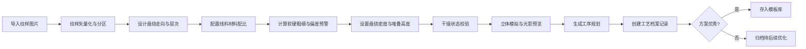

## 1. 产品概述

传统漆线雕盘绕线料搓制与堆叠造型生产力系统，面向漆线雕非遗工艺传承与数字化生产，解决手工工艺中纹样规划难、线料配比凭经验、质量把控难、工艺传承无记录等核心痛点。

- 面向漆线雕工艺师、非遗传承人、工艺美术院校师生、传统工艺生产企业
- 通过数字化工具将传统经验转化为可量化、可追溯、可复用的工艺体系，提升生产效率与作品质量，促进非遗工艺的传承与创新

## 2. 核心功能

### 2.1 用户角色

| 角色 | 注册方式 | 核心权限 |
|------|----------|----------|
| 工艺师 | 本地账号 | 完整使用所有功能，创建管理作品与工艺档案 |
| 学员 | 本地账号 | 使用纹样解析、线料搓制、盘绕造型功能，浏览模板库 |
| 管理员 | 管理员账号 | 模板库审核、系统参数配置、用户管理 |

### 2.2 功能模块

1. **纹样解析页**：导入纹样图片、路径矢量化、纹样分区规划、盘绕走向层次设计
2. **线料搓制页**：漆线材料配比参数、软硬粗细计算、配方偏差预警标红、搓制工序指导
3. **盘绕造型页**：盘绕密度与堆叠高度计算、干燥状态校验、立体层次模拟、光影效果预览
4. **工艺档案页**：作品盘绕走向记录、工序时间轴、工艺参数归档、风险预警追溯
5. **模板库页**：经典纹样方案存储、模板分类检索、参数化复用、版本管理

### 2.3 页面详情

| 页面名称 | 模块名称 | 功能描述 |
|---------|---------|---------|
| 纹样解析页 | 纹样导入 | 支持PNG/JPG/SVG格式图片上传与预览 |
| 纹样解析页 | 矢量化处理 | 边缘检测、轮廓提取、路径平滑优化 |
| 纹样解析页 | 分区规划 | 手动分区或自动分区，标注主次纹饰区域 |
| 纹样解析页 | 走向设计 | 可视化绘制漆线盘绕路径，设置层次堆叠顺序 |
| 纹样解析页 | 方案导出 | 导出纹样解析方案JSON，供后续页面使用 |
| 线料搓制页 | 材料配比 | 漆料/桐油/砖粉/金粉等材料比例调节滑块 |
| 线料搓制页 | 软硬计算 | 根据配比计算线料硬度值、可塑性指数 |
| 线料搓制页 | 粗细规格 | 线径参数设置，按搓制工艺推荐规格 |
| 线料搓制页 | 偏差预警 | 过软坍塌/过硬易断区域红色高亮标注，给出调整建议 |
| 线料搓制页 | 搓制工序 | 分步骤搓制指导，含搓制时长、温度、湿度要求 |
| 盘绕造型页 | 密度计算 | 按纹样区域计算单位长度盘绕圈数与间距 |
| 盘绕造型页 | 堆叠高度 | 多层堆叠高度计算，显示剖面图 |
| 盘绕造型页 | 干燥校验 | 环境温湿度输入，估算干燥时间与风险提示 |
| 盘绕造型页 | 立体模拟 | 2.5D/伪3D堆叠造型渲染，层次分明 |
| 盘绕造型页 | 光影效果 | 侧光、顶光模拟，显示贴金后视觉效果 |
| 盘绕造型页 | 工序规划 | 搓线→盘绕→堆叠→贴金工序时间轴 |
| 工艺档案页 | 作品列表 | 卡片式作品列表，含缩略图、创作时间、状态 |
| 工艺档案页 | 盘绕记录 | 每件作品完整盘绕走向路径数据可视化 |
| 工艺档案页 | 工艺参数 | 线料配比、环境参数、时长等完整参数归档 |
| 工艺档案页 | 风险预警 | 失水变脆、盘绕断裂等风险记录与预警提示 |
| 工艺档案页 | 工艺报告 | 生成作品工艺档案PDF/导出数据 |
| 模板库页 | 模板分类 | 按纹样类型：龙凤、花鸟、云水、人物、几何等分类 |
| 模板库页 | 模板检索 | 关键词搜索、标签筛选、复杂度筛选 |
| 模板库页 | 模板详情 | 查看纹样方案、线料配比、盘绕参数完整方案 |
| 模板库页 | 复用应用 | 一键套用模板参数到新作品，支持参数微调 |
| 模板库页 | 版本管理 | 模板更新版本记录，支持回退到历史版本 |

## 3. 核心流程

用户完整工艺设计流程：从导入纹样开始，经过解析分区规划走向，再设计线料搓制配方，然后进行盘绕造型仿真，完成后存入工艺档案，优秀方案可发布到模板库供复用。

## 4. 用户界面设计

### 4.1 设计风格

- **主色调**：深朱红(#8B2323)作为主色，象征传统大漆的色泽；辅色为金色(#D4AF37)，呼应贴金工艺；中性色为深墨色(#2C1810)与米黄色(#F5EFE0)
- **按钮风格**：微圆角(6px)、朱红渐变底配金边，悬停时有轻微上浮与发光效果
- **字体**：标题使用「思源宋体」体现传统韵味，正文使用「思源黑体」保证可读性
- **布局风格**：左右分栏+顶部导航，左侧工具栏右侧画布/参数区，卡片式信息容器，配传统回纹边框装饰
- **图标风格**：线性描边图标配朱红/金色点缀，融入祥云、回纹等传统装饰元素

### 4.2 页面设计概览

| 页面名称 | 模块名称 | UI元素 |
|---------|---------|--------|
| 纹样解析页 | 主画布区 | 大尺寸SVG画布，支持缩放平移，网格背景，纹样轮廓描金显示 |
| 纹样解析页 | 分区工具条 | 分区选择器、颜色标识、层次排序拖拽条 |
| 纹样解析页 | 走向绘制 | 贝塞尔曲线工具、方向箭头、层次Z轴滑块 |
| 线料搓制页 | 配比面板 | 多组滑块+数值输入，实时饼图显示比例，动态朱红/金色渐变 |
| 线料搓制页 | 硬度仪表 | 半圆仪表盘，绿色安全区/黄色警告区/红色危险区，指针动画 |
| 线料搓制页 | 偏差预警区 | 红色圆角卡片，闪烁边框动画，建议列表 |
| 线料搓制页 | 工序步骤条 | 竖向时间轴，步骤状态图标，步骤卡展开动画 |
| 盘绕造型页 | 密度热力图 | 纹样底图上叠加彩色热力，颜色深浅表示密度 |
| 盘绕造型页 | 堆叠剖面 | 侧视剖面图，层叠矩形显示不同颜色层次 |
| 盘绕造型页 | 立体预览 | 伪3D斜视图，可旋转角度滑块，实时光影变化 |
| 盘绕造型页 | 工序甘特 | 横向时间轴，色块区分工序，悬停显示详情 |
| 工艺档案页 | 作品卡片墙 | 瀑布流布局，悬停放大预览，状态徽章 |
| 工艺档案页 | 详情侧抽屉 | 从右滑入，路径动画播放，参数表格 |
| 工艺档案页 | 风险预警条 | 顶部红色/橙色Banner，带铃铛图标与数量角标 |
| 模板库页 | 分类导航 | 左侧垂直分类菜单，当前项朱红底金边 |
| 模板库页 | 模板网格 | 方形卡片，缩略图+标题+标签，悬停上浮效果 |
| 模板库页 | 详情模态 | 居中大弹窗，双栏布局参数+预览 |

### 4.3 响应式

- Desktop优先设计，主画布区域最小支持1280px宽度
- 平板端(768-1024px)：工具栏折叠为图标按钮，画布区自适应
- 移动端(<768px)：简化为标签页切换，画布支持触摸手势操作

### 4.4 立体与光影指引

- 盘绕造型页采用伪3D效果：CSS transform + 多层堆叠 + 渐变模拟立体感
- 光影通过CSS radial-gradient实现，角度参数控制光源方向
- 堆叠层次通过box-shadow层层叠加产生纵深感
- 贴金效果通过金色线性渐变+微光噪点纹理模拟
