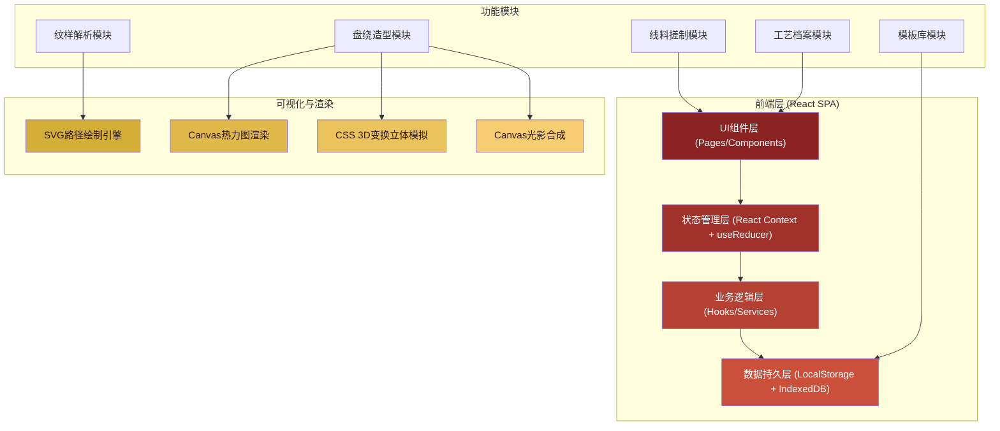
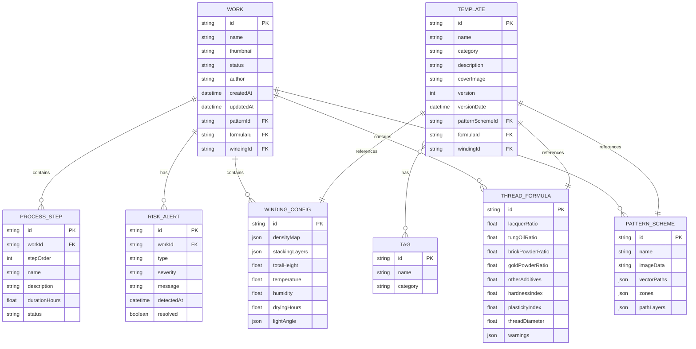

## 1. 架构设计



## 2. 技术说明

- **前端框架**: React@18.2 + TypeScript@5
- **构建工具**: Vite@5
- **样式方案**: Tailwind CSS@3.4 + CSS变量主题系统
- **路由管理**: React Router@6
- **图标方案**: Lucide React + 自定义传统纹样SVG图标
- **数据持久化**: LocalStorage (配置/状态) + IndexedDB (作品档案/模板库大容量数据)
- **可视化**: 原生SVG API (路径绘制) + Canvas 2D (热力图/光影) + CSS transform (伪3D效果)
- **表单处理**: React Hook Form + Zod数据校验
- **图表仪表**: 原生Canvas自绘仪表盘+饼图，避免引入重型图表库

## 3. 路由定义

| 路由路径 | 页面名称 | 说明 |
|---------|---------|------|
| `/` | 首页/仪表盘 | 系统概览、快捷入口、统计卡片、最近作品 |
| `/pattern` | 纹样解析页 | 纹样导入、矢量化、分区规划、走向设计 |
| `/thread` | 线料搓制页 | 材料配比、软硬计算、偏差预警、工序指导 |
| `/winding` | 盘绕造型页 | 密度计算、堆叠高度、立体模拟、光影预览 |
| `/archive` | 工艺档案页 | 作品列表、盘绕记录、工艺参数、风险预警 |
| `/templates` | 模板库页 | 模板分类、检索、详情、复用应用 |

## 4. 数据模型

### 4.1 核心数据实体



### 4.2 本地存储键名规范

| 存储类型 | 键名前缀 | 存储内容 |
|---------|---------|---------|
| LocalStorage | `qxd_` | 用户偏好设置、当前工作状态 |
| IndexedDB | works | 作品档案表 |
| IndexedDB | patterns | 纹样方案表 |
| IndexedDB | formulas | 线料配方表 |
| IndexedDB | windings | 盘绕配置表 |
| IndexedDB | templates | 模板库表 |
| IndexedDB | tags | 标签表 |

## 5. 核心算法与计算模型

### 5.1 线料硬度计算模型
```
硬度指数 HI = (漆料占比 × 2.5 + 砖粉占比 × 4.0 + 金粉占比 × 1.8 - 桐油占比 × 3.2) × 10
安全区间: 55 ≤ HI ≤ 85
< 55: 过软易坍塌 (红色预警)
> 85: 过硬易断裂 (红色预警)
45-55 或 85-95: 黄色警告
```

### 5.2 干燥时间估算模型
```
干燥小时数 = 基础时间 × (湿度修正系数) × (温度修正系数) × (堆叠层数系数)
基础时间 = 线径(mm) × 2.4
湿度修正: <40% RH=0.8, 40-65%=1.0, >65%=1.5
温度修正: <18°C=1.6, 18-28°C=1.0, >28°C=0.7
层数修正: 1-2层=1.0, 3-4层=1.2, 5+层=1.5
```

### 5.3 失水变脆风险指数
```
风险指数 RI = |当前RH% - 理想RH(55%)| / 20 + 已干燥时长/预计干燥时长
RI < 0.6: 低风险 (绿色)
0.6 ≤ RI < 1.0: 中风险 (黄色)
RI ≥ 1.0: 高风险 (红色预警)
```

### 5.4 盘绕密度计算
```
区域密度 D = 该区域漆线总长度 / 区域面积
密度等级: 稀疏(D<5) / 适中(5≤D<12) / 紧密(12≤D<20) / 极密(D≥20)
堆叠层数: 根据纹样主次区域自动推荐 1-6 层
```

## 6. 项目目录结构

```
src/
├── assets/
│   ├── fonts/          # 思源字体文件
│   ├── patterns/       # 传统纹样SVG素材
│   └── textures/       # 噪点纹理/金箔纹理
├── components/
│   ├── layout/         # 布局组件(Header/Sidebar/Nav)
│   ├── common/         # 通用组件(Button/Card/Modal/Tabs)
│   ├── pattern/        # 纹样解析页专用组件
│   ├── thread/         # 线料搓制页专用组件
│   ├── winding/        # 盘绕造型页专用组件
│   ├── archive/        # 工艺档案页专用组件
│   └── templates/      # 模板库页专用组件
├── hooks/
│   ├── useIndexedDB.ts # IndexedDB封装Hook
│   ├── useFormulaCalc.ts # 配方计算Hook
│   ├── useDensityCalc.ts # 密度计算Hook
│   └── usePathEditor.ts # 路径编辑Hook
├── contexts/
│   ├── AppContext.tsx  # 全局应用状态
│   └── WorkContext.tsx # 当前工作状态
├── types/
│   └── index.ts        # TypeScript类型定义
├── utils/
│   ├── calculations.ts # 计算公式集合
│   ├── svgUtils.ts     # SVG工具函数
│   ├── canvasUtils.ts  # Canvas工具函数
│   └── storage.ts      # 存储工具函数
├── data/
│   ├── mockData.ts     # Mock演示数据
│   └── seedTemplates.ts # 初始模板种子数据
├── pages/
│   ├── Dashboard.tsx   # 首页
│   ├── PatternPage.tsx # 纹样解析
│   ├── ThreadPage.tsx  # 线料搓制
│   ├── WindingPage.tsx # 盘绕造型
│   ├── ArchivePage.tsx # 工艺档案
│   └── TemplatesPage.tsx # 模板库
├── styles/
│   ├── globals.css     # 全局样式与Tailwind
│   └── theme.css       # CSS变量主题定义
├── App.tsx
├── main.tsx
└── router.tsx          # 路由配置
```
